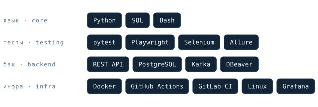

  <picture>
    <source media="(prefers-color-scheme: dark)" srcset="assets/banner-dark.svg" />
    <source media="(prefers-color-scheme: light)" srcset="assets/banner-light.svg" />
    
  </picture>

  
    <a href="https://t.me/i1ceazer">telegram</a>
     · 
    <a href="mailto:nesterov25ivan@yandex.ru">email</a>
  

 

  <picture>
    <source media="(prefers-color-scheme: dark)" srcset="assets/about-dark.svg" />
    <source media="(prefers-color-scheme: light)" srcset="assets/about-light.svg" />
    
  </picture>

* 🧪 &nbsp;Testing: API, UI, backend logic, data flows.
* 💼 &nbsp;Open to job offers.
* 🛠️ &nbsp;Pet projects on test automation here.

 

  <picture>
    <source media="(prefers-color-scheme: dark)" srcset="assets/divider-dark.svg" />
    <source media="(prefers-color-scheme: light)" srcset="assets/divider-light.svg" />
    
  </picture>

  <picture>
    <source media="(prefers-color-scheme: dark)" srcset="assets/stack-dark.svg" />
    <source media="(prefers-color-scheme: light)" srcset="assets/stack-light.svg" />
    
  </picture>

  <picture>
    <source media="(prefers-color-scheme: dark)" srcset="assets/divider-dark.svg" />
    <source media="(prefers-color-scheme: light)" srcset="assets/divider-light.svg" />
    
  </picture>

  <picture>
    <source media="(prefers-color-scheme: dark)" srcset="https://raw.githubusercontent.com/i1ceazer/i1ceazer/output/snake-dark.svg" />
    <source media="(prefers-color-scheme: light)" srcset="https://raw.githubusercontent.com/i1ceazer/i1ceazer/output/snake-light.svg" />
    
  </picture>

  <picture>
    <source media="(prefers-color-scheme: dark)" srcset="assets/divider-dark.svg" />
    <source media="(prefers-color-scheme: light)" srcset="assets/divider-light.svg" />
    
  </picture>

  <i>«Семь раз отмерь — один раз отрежь»</i>

